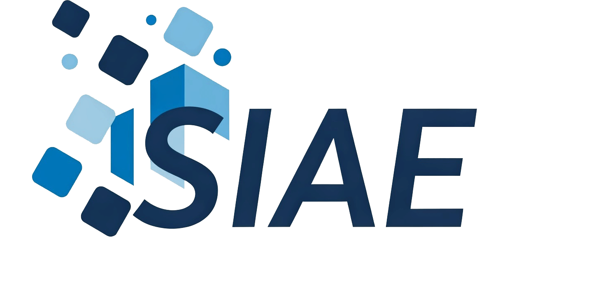

  

  

<h1>Sistema Informático de Asignación de Espacios Académicos (SIAE)</h1>

¡Bienvenido al <b>Sistema Informático de Asignación de Espacios Académicos (SIAE)</b>!

SIAE es una aplicación robusta diseñada para <b>optimizar y simplificar la gestión</b> de la asignación de espacios, recursos y horarios dentro de instituciones educativas. Nuestro objetivo es <b>automatizar procesos clave</b>, reducir errores manuales y mejorar la eficiencia en la planificación académica.

Actualmente, el sistema ya cuenta con una <b>infraestructura base completa</b>, incluyendo:

<ul>
  <li><b>Gestión de Usuarios, Roles y Permisos:</b> Control total sobre quién accede al sistema y qué acciones puede realizar.</li>
  <li><b>Módulos de Configuración Académica:</b> Administración de <b>PNF</b>, <b>Sedes</b>, <b>Secciones</b>, <b>Trayectos</b>, <b>Aulas</b>, <b>Unidades Curriculares</b>, <b>Tipos de Aulas/Unidades</b>, <b>Duración</b>, <b>Días</b> y <b>Horas Académicas</b>, sentando las bases para una asignación precisa.</li>
  <li><b>Interfaz de Usuario Esencial:</b> Un <b>Dashboard</b> intuitivo y un <b>Sistema de Login</b> seguro para una experiencia de usuario fluida.</li>
  <li><b>Reportes Básicos:</b> Generación de informes fundamentales para el seguimiento y la toma de decisiones.</li>
</ul>

Estamos trabajando activamente en la implementación de funcionalidades avanzadas como la <b>carga masiva de datos</b> y la <b>generación automatizada de horarios</b>, características que prometen revolucionar la forma en que se gestionan los recursos académicos.

